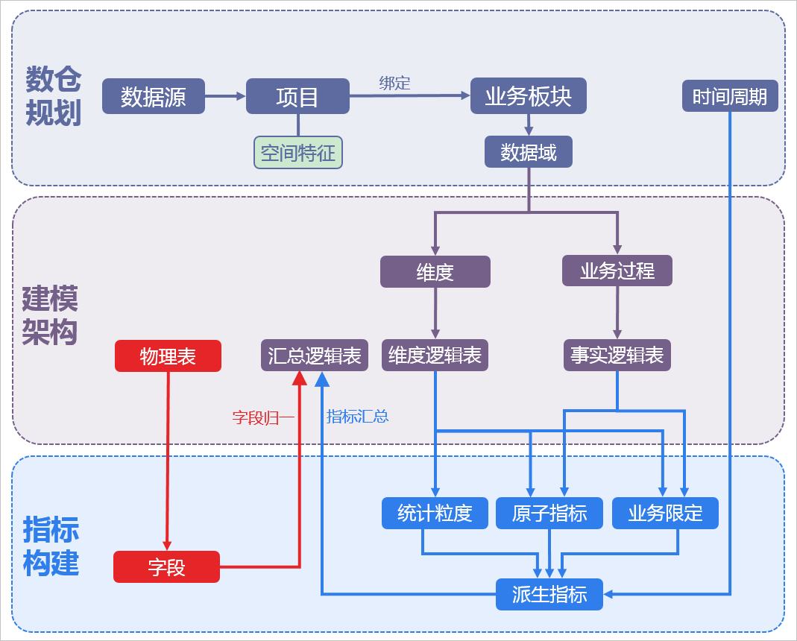
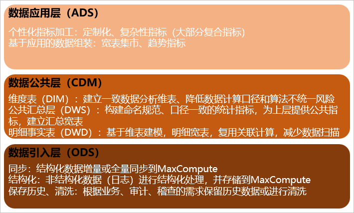
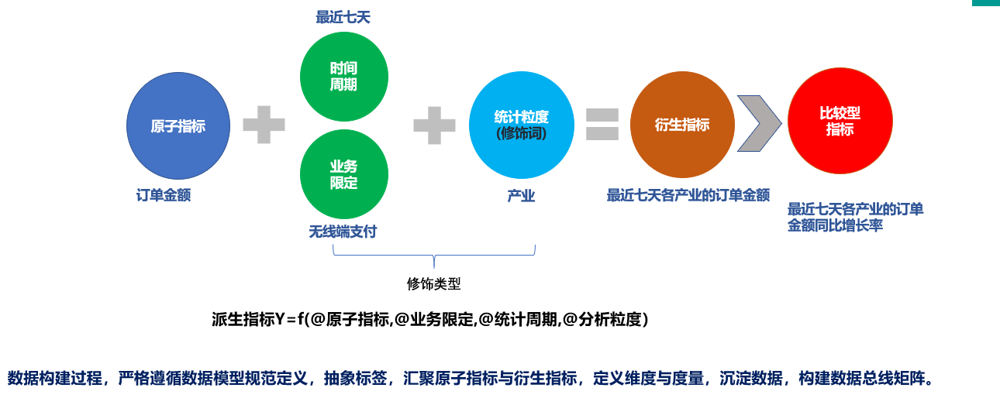
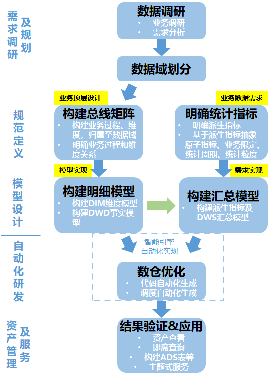
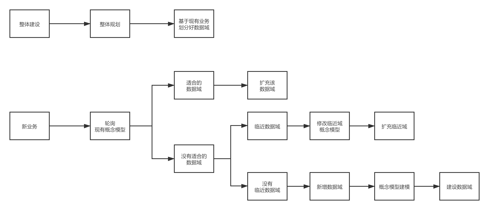

# 数据中台建设手册

## 0x00.基本概念术语确定

### a.关于表设计`键`的术语

- 键：键是唯一标识一个实体的一个或者多个数据属性。在物理数据库中，键可以由表的一个或者多个列组成，它们的值唯一标识关系表中的一行。
- 复合键：由两个或者多个属性组成的键。
- 自然键：由现实世界中已经存在的属性组成的键。例如，美国公民被分配了一个唯一（不保证一定正确，但实际上非常接近唯一）的社会保险号（SSN）。如果隐私法允许的话，SSN可能被用作Person实体的自然键（假设组织的人员范围仅限于美国）。
- 代理键：不具有业务含义的键。
- 候选键：在逻辑数据模型中的实体类型可能具有0或多个候选键，简称为唯一标识（注解：某些人不主张在逻辑数据模型中标识候选键，因此没有固定标准）。例如，假设我们只涉及美国公民，那么SSN。Person实体类型的一个候选键，同时姓名与电话号码的组合（假设组合是唯一的）是第二个可能的候选键。这两个键都被称作候选键是因为它们是物理数据模型中主键、次键或者非键的候选目标。
- 主键：实体类型的首选键。
- 备用键：也就是次键，是表中行的另一个唯一标识。
- 外键：在一个实体类型中表示另一个实体类型的主键或者次键的一个或多个属性。

> 对上述不够明确的同学推荐阅读：[Choosing a Primary Key: Natural or Surrogate?](http://www.agiledata.org/essays/keys.html)

### b.关于数据仓库的表设计

- 3nf：
- 维度建模：

### c.数仓中的一些基本概念

- 业务板块：比数据域更高维度的业务划分方法，适用于特别庞大的业务系统。
- 维度：维度建模由Ralph Kimball提出。维度模型主张从分析决策的需求出发构建模型，为分析需求服务。维度是度量的环境，是我们观察业务的角度，用来反映业务的一类属性 。属性的集合构成维度 ，也可以称为实体对象。例如， 在分析交易过程时，可以通过买家、卖家、商品和时间等维度描述交易发生的环境。
- 属性（维度属性）：维度所包含的表示维度的列称为维度属性。维度属性是查询约束条件、分组和报表标签生成的基本来源，是数据易用性的关键。
- 度量：在维度建模中，将度量称为事实 ， 将环境描述为维度，维度是用于分析事实所需要的多样环境。度量通常为数值型数据，作为事实逻辑表的事实。
- 指标：指标分为原子指标和派生指标。原子指标是基于某一业务事件行为下的度量，是业务定义中不可再拆分的指标，是具有明确业务含义的名词 ，体现明确的业务统计口径和计算逻辑，例如支付金额。
- 原子指标 = 业务过程 + 度量
- 派生指标 = 时间周期 + 修饰词 + 原子指标，派生指标可以理解为对原子指标业务统计范围的圈定。
- 业务限定：统计的业务范围，筛选出符合业务规则的记录（类似于SQL中where后的条件，不包括时间区间）。
- 统计周期：统计的时间范围，例如最近一天，最近30天等（类似于SQL中where后的时间条件）。
- 统计粒度：统计分析的对象或视角，定义数据需要汇总的程度，可理解为聚合运算时的分组条件（类似于SQL中的group by的对象）。粒度是维度的一个组合，指明您的统计范围。例如，某个指标是某个卖家在某个省份的成交额，则粒度就是卖家、地区这两个维度的组合。如果您需要统计全表的数据，则粒度为全表。在指定粒度时，您需要充分考虑到业务和维度的关系。统计粒度常作为派生指标的修饰词而存在。

基本概念之间的关系和举例如下图所示:

## 0x01.数据收集

### 1.整库导入（业务数据库）

#### a.原理

#### b.选型

- sqoop

### 2.日志接入

#### a.原理

#### b.选型

- flume + kafka
- elk日志云数据导入

### 3.前端埋点

#### a.原理

#### b.选型

- 百度指数
- google
- io
- 神策数据
- 自研

### 4.网络爬虫

#### a.原理

#### b.选型

- 自研

### 5.数据接口接入

#### a.原理

- 按照数据格式，json/xml等接入方式解析

### 6.物理接入（硬盘，数据魔方）

- 按照业务需求，需要平台提供对应导入接口

### 7.购买

- 按照数据形式进行解析，平台需要对应提供接入能力

## 0x02.数据划分

### 1.横向拆分

> 在阿里巴巴的数据体系中，我们建议将数据仓库分为三层，自下而上为：数据引入层（ODS，Operation Data Store）、数据公共层（CDM，Common Data Model）和数据应用层（ADS，Application Data Service）。

数据仓库的分层和各层级用途如下图所示。

- 数据引入层（ODS，Operation Data Store）：将原始数据几乎无处理的存放在数据仓库系统，结构上与源系统基本保持一致，是数据仓库的数据准备区。主要完成基础数据引入到数据平台的职责，同时可以基础数据记录的历史变化的。 
- 数据公共层（CDM，Common Data Model，又称通用数据模型层），包含DIM维度表、DWD和DWS，由ODS层数据加工而成。主要完成数据加工与整合，建立一致性的维度，构建可复用的面向分析和统计的明细事实表，以及汇总公共粒度的指标。
  - 公共维度层（DIM，Dimension）：基于`维度建模`理念思想，建立整个企业的一致性维度。降低数据计算口径和算法不统一风险。 公共维度层的表通常也被称为逻辑维度表，维度和维度逻辑表通常一一对应。建立一致性维度是整个企业数据仓库搭建的重中之重。
  - 明细粒度事实层（DWD，Data Warehouse Details）：以业务过程作为建模驱动，基于每个具体的业务过程特点，构建最细粒度的明细层事实表。可以结合企业的数据使用特点，将明细事实表的某些重要维度属性字段做适当冗余，即宽表化处理。 明细粒度事实层的表通常也被称为逻辑事实表。
  - 公共汇总粒度事实层（DWS，Data Warehouse Service）：以分析的主题对象作为建模驱动，基于上层的应用和产品的指标需求，构建公共粒度的汇总指标事实表，以宽表化手段物理化模型。构建命名规范、口径一致的统计指标，为上层提供公共指标，建立汇总宽表、明细事实表。 公共汇总粒度事实层的表通常也被称为汇总逻辑表，用于存放派生指标数据。
- 数据应用层（ADS，Application Data Service）：存放数据产品个性化的统计指标数据。根据CDM与ODS层加工生成，ADS层更像是一个逻辑上的概念，里面可能包含了宽表层的一些数据指标，同样为了方便更喜欢讲统计后的不可复用的结果直接对接应用的数据放置再应用数据层。

#### 0.数据规范定义

> 规范定义是指以维度建模、3NF范式建模作为理论基础，构建总线矩阵，划分和定义数据域、业务过程、维度、度量、原子指标、修饰类型、修饰词、时间周期、衍生指标等。细粒度的划分便于指标的规则沉淀。
> 衍生指标构成：原子指标、业务限定、时间周期、统计粒度。其中原子子标必须有，时间周期、业务限定、统计粒度等可选。

解释一下：这里算子指标就是我们已经存在的事实表，在这基础上我们会有一定的维度限定条件举个例子。订单表可以使用时间周期限定（最近一个月）也可以使用特定的业务限定（移动端支付/pc支付）等当然有的指标也是同样可以用于统计维度的，但是我们对目前这个指标用sql理解就是where后面的条件，而统计维度则是基于这个维度进行分组聚合例如统计某一个地区（北京或上海的用户）或某一周产业（电子产品或者母婴等）使用sql方式去理解这里其实就是group by后面的字段，通过前面的限界条件可以得到一个新的衍生指标，这就是我们结果数据。一般这类衍生的指标是直接服务于数据应用或者发布成数据服务，存储在ads层
基于上述的数据定义，结合数据及业务的可持续发展，建议进行的表命名规范，所有的规范初期都是比较繁琐复杂，但坚持下来可以带来的复利是可以见到的：
- ODS：`ods_[业务库名]_{业务库原始表名}[_delta]`
- DWD：`dwd_{主题缩写}_{业务过程缩写}[_自定义标签缩写]_{单分区增量全量标识}`
- DWS：`dws_{数据域缩写}[_自定义标签缩写]_{刷新周期标识}`
- ADS：`ads_ [_业务应用缩写][_维度][_自定义标签缩写]_{刷新周期标识}`
- DIM：`dim_{维度定义}`

#### 1.数据引入层（ODS，Operation Data Store）又叫操作数据层

> ODS层存放您从业务系统获取的最原始的数据，是其他上层数据的源数据。业务数据系统中的数据通常为非常细节的数据，经过长时间累积，且访问频率很高，是面向应用的数据。注意数据引入时的类型转换（业务系统与数仓间的类型，具体根据数仓选型来定），其他尽量与源系统一直即可。

##### a.数据引入层表设计

本教程中，在ODS层主要包括的数据有：交易系统订单详情、用户信息详情、商品详情等。这些数据未经处理，是最原始的数据。逻辑上，这些数据都是以二维表的形式存储。虽然严格的说ODS层不属于数仓建模的范畴，但是合理的规划ODS层并做好数据同步也非常重要。本教程中，使用了6张ODS表：

- 记录用于拍卖的商品信息：`ods_auction` 
- 记录用于正常售卖的商品信息：`ods_sale` 
- 记录用户详细信息：`ods_users_extra` 
- 记录新增的商品成交订单信息：`ods_biz_order_delta`
- 记录新增的物流订单信息：`ods_logistics_order_delta`
- 记录新增的支付订单信息：`ods_pay_order_delta`

> **说明：**
> 1. 表或字段命名尽量和业务系统保持一致，但是需要通过额外的标识来区分增量和全量表。例如，我们通过`_delta`来标识该表为增量表。
> 2. 命名时需要特别注意冲突处理，例如不同业务系统的表可能是同一个名称。为区分两个不同的表，您可以将这两个同名表的来源数据库名称作为后缀或前缀。例如，表中某些字段的名称刚好和关键字重名了，可以通过添加`_col1`后缀解决。

##### b.数据引入层存储

为了满足历史数据分析需求，您可以在ODS层表中添加时间维度作为分区字段。实际应用中，您可以选择采用**增量**、**全量存储**或**拉链存储**的方式。

- 增量存储

以天为单位的增量存储，以业务日期作为分区，每个分区存放日增量的业务数据。 举例如下：

1月1日，用户A访问了A公司电商店铺B，A公司电商日志产生一条记录t1。1月2日，用户A又访问了A公司电商店铺C，A公司电商日志产生一条记录t2。采用增量存储方式，t1将存储在1月1日这个分区中，t2将存储在1月2日这个分区中。

|记录|用户|店铺|日期(分区)|
|-|-|-|-|
|t1|A|B|20200101|
|t2|A|C|20200102|

1月1日，用户A在A公司电商网购买了B商品，交易日志将生成一条记录t1。1月2日，用户A又将B商品退货了，交易日志将更新t1记录。采用增量存储方式，初始购买的t1记录将存储在1月1日这个分区中，更新后的t1将存储在1月2日这个分区中。

|记录|用户|商品|状态|日期(分区)|
|-|-|-|-|-|
|t1|A|B|购买|20200101|
|t2|A|B|退货|20200102|

> **说明：**交易、日志等事务性较强的ODS表适合增量存储方式。这类表数据量较大，采用全量存储的方式存储成本压力大。此外，这类表的下游应用对于历史全量数据访问的需求较小（此类需求可通过数据仓库后续汇总后得到）。例如，日志类ODS表没有数据更新的业务过程，因此所有增量分区UNION在一起就是一份全量数据。

- 全量存储

以天为单位的全量存储，以业务日期作为分区，每个分区存放截止到业务日期为止的全量业务数据。 例如， 1月1日，卖家A在A公司电商网发布了B、C两个商品，前端商品表将生成两条记录t1、t2。1月2日，卖家A将B商品下架了，同时又发布了商品D，前端商品表将更新记录t1，同时新生成记录t3。采用全量存储方式， 在1月1日这个分区中存储t1和t2两条记录，在1月2日这个分区中存储更新后的t1以及t2、t3记录。

|记录|用户|商品|状态|日期(分区)|
|-|-|-|-|-|
|t1|卖家A|商品B|上架|20200101|
|t2|卖家A|商品C|上架|20200101|
|t1|卖家A|商品B|下架|20200102|
|t2|卖家A|商品C|上架|20200102|
|t3|卖家A|商品D|上架|20200102|

> **说明：**对于小数据量的缓慢变化维度数据，例如商品类目，可直接使用全量存储。

- 拉链存储

拉链存储通过新增两个时间戳字段（start_dt和end_dt），将所有以天为粒度的变更数据都记录下来，通常分区字段也是这两个时间戳字段。

拉链存储举例如下。

|商品|start_dt|end_dt|卖家|状态|
|-|-|-|-|-|
|B|20160101|20160102|A|上架|
|C|20160101|30001231|A|上架|
|B|20160102|30001231|A|下架|

> 这样，下游应用可以通过限制时间戳字段来获取历史数据。例如，用户访问1月1日数据，只需限制 `stat_dt` <= '20160101' AND `end_dt` > '20160101'。

- 缓慢变化维度

构建数据架构时不推荐使用代理键，推荐使用自然键作为维度主键，主要原因有两点：
- 数据中台使用的一般都是分布式计算引擎，生成全局唯一的代理键工作量非常大。当遇到大数据量情况下，这项工作就会更加复杂，且没有必要。
- 使用代理键会增加ETL的复杂性，从而增加ETL任务的开发和维护成本。
- 因为是分布式系统，统一不重复的代理键维护起来并不容易。

在不使用代理键的情况下，缓慢变化维度可以通过快照方式处理。
快照方式下数据的计算周期通常为每天一次。基于该周期，处理维度变化的方式为每天一份全量快照。

例如商品维度，每天保留一份全量商品快照数据。任意一天的事实表均可以取到当天的商品信息，也可以取到最新的商品信息，通过限定日期，采用自然键进行关联即可。该方式的优势主要有以下两点：
- 处理缓慢变化维度的方式简单有效，开发和维护成本低。
- 使用方便，易于理解。数据使用方只需要限定日期即可取到当天的快照数据。任意一天的事实快照与任意一天的维度快照通过维度的自然键进行关联即可。

该方法的弊端主要是存储空间的极大浪费。例如某维度每天的变化量占总体数据量比例很低，极端情况下，每天无变化，这种情况下存储浪费严重。该方法主要实现了通过牺牲存储获取ETL效率的优化和逻辑上的简化。请避免过度使用该方法，且必须要有对应的数据生命周期制度，清除无用的历史数据。

##### c.数据同步加载与处理

ODS的数据需要由各数据源系统同步到数据仓库，才能用于进一步的数据开发。在使用数据集成的过程中，建议您遵循以下规范：
- 一个系统的源表只允许同步到数据中台一次，保持表结构的一致性。
- 数据集成仅用于离线全量数据同步，实时增量数据同步要使用流式的方式处理。
- 数据集成全量同步的数据直接进入全量表的当日分区。
- 同步数据主要有两步：
  - 全量初始化。对于同步的每个表，全量初始化的数据都会独立存储在数据仓库中的全量基线表中，这个表名的默认格式为：源表名_base。
  - 增量数据同步。增量数据实时同步到数据仓库中。并存储在增量日志表中，每个同步表对应一个增量日志表。在增量数据同步时，会使用合并多条记录到一个文件的方式写入到数据仓库中。增量日志表在数据仓库中存储的表名的默认格式为：源表名_log。
  - 根据同步到数据仓库中的全量基线表和增量日志数据得到某个时刻表的全量数据，可以使用sql合并全部数据写入新的表的方式来进行数据合并。
- ODS层的表建议以统计日期及时间分区表的方式存储，便于管理数据的存储成本和策略控制。
- 数据集成可以自适应处理源系统字段的变更：
  - 如果源系统字段的目标表在数据仓库不存在，可以由数据集成自动添加不存在的表字段。
  - 如果目标表的字段在源系统不存在，数据集成填充NULL。

##### d.数据存储及生命周期管理

|数据表类型|存储方式|最长存储保留策略|
|-|-|-|
|ODS流水型全量表|按天分区|不可再生情况下永久保存。日志（非常大，例如一天数据大于100GB）数据保留24个月。自主设置是否保留历史月初数据。自主设置是否保留特殊日期数据。|
|ODS镜像型全量表|按天分区|重要的业务表及需要保留历史的表视情况保存。ODS全量表的默认生命周期管理为保留2天，并采用ds=max_pt(tablename)方式进行数据访问。ODS增量表。按天分区。有对应的全量表则最多保留最近14天分区数据。无全量表的增量数据需永久保留。|
|ODS ETL过程临时表|按天分区|最多保留最近7天分区。|
|BDSync非去重数据|按天分区|由应用通过中间层做保留历史处理，默认ODS层不保留历史。|

##### e.数据质量规范

- 每个ODS全量表必须配置唯一性字段标识。
- 每个ODS全量表必须做分区空数据监控。
- 建议对重要表的重要枚举类型字段做枚举值变化及枚举值分布监控。
- 建议对ODS表的数据量及数据记录数设置上周同比无变化监控，用于监控源系统是否下线或者已迁移。
- 只有有监控要求的表才创建数据质量管控层，应由DataWorks的数据质量配置完成。
- 每个ODS层全表都必须要有注释。

#### 2.数据公共层（CDM，Common Data Model）

> 数据公共层CDM可以细分为三层，分别为公共维度层（DIM，Dimension）、明细粒度事实层（DWD，Data Warehouse Details）、公共汇总粒度事实层（DWS，Data Warehouse Service），下面分别介绍：

##### a.公共维度层（DIM，Dimension）

公共维度层（DIM）基于维度建模理念，建立整个企业的一致性维度。

公共维度层主要由维度表（维表）构成。维度是逻辑概念，是衡量和观察业务的角度。维表是根据维度及其属性将数据平台上构建的表物理化的表，采用宽表设计的原则。因此，构建公共维度层（DIM）首先需要定义维度。

###### I.定义维度

在划分数据域、构建总线矩阵时，需要结合对业务过程的分析定义维度。

作为维度建模的核心，在企业级数据仓库中必须保证维度的唯一性。以A公司的商品维度为例，有且只允许有一种维度定义。例如，省份code这个维度，对于任何业务过程所传达的信息都是一致的。

###### II.设计维表

完成维度定义后，您就可以对维度进行补充，进而生成维表了。维表的设计需要注意：
- 建议维表单表信息不超过1000万条。
- 维表与其他表进行Join时，建议您使用Map Join。使用mapjoin缓存小表，可以有效避免数据倾斜。
- 避免过于频繁的更新维表的数据。

在设计维表时，您需要从下列方面进行考虑：
- 维表中数据的稳定性。例如A公司电商会员通常不会出现消亡，但会员数据可能在任何时候更新，此时要考虑创建单个分区存储全量数据。如果存在不会更新的记录，您可能需要分别创建历史表与日常表。日常表用于存放当前有效的记录，保持表的数据量不会膨胀；历史表根据消亡时间插入对应分区，使用单个分区存放分区对应时间的消亡记录。
- 是否需要垂直拆分。如果一个维表存在大量属性不被使用，或由于承载过多属性字段导致查询变慢，则需考虑对字段进行拆分，创建多个维表。
- 是否需要水平拆分。如果记录之间有明显的界限，可以考虑拆成多个表或设计成多级分区。
- 核心的维表产出时间通常有严格的要求。

设计维表的主要步骤如下：
1. 完成维度的初步定义，并保证维度的一致性。
2. 确定主维表（中心事实表，本教程中采用星型模型）。此处的主维表通常是数据引入层（ODS）表，直接与业务系统同步。例如，s_auction是与前台商品中心系统同步的商品表，此表即是主维表。
3. 确定相关维表。数据仓库是业务源系统的数据整合，不同业务系统或者同一业务系统中的表之间存在关联性。根据对业务的梳理，确定哪些表和主维表存在关联关系，并选择其中的某些表用于生成维度属性。以商品维度为例，根据对业务逻辑的梳理，可以得到商品与类目、卖家、店铺等维度存在关联关系。
4. 确定维度属性，主要包括两个阶段。第一个阶段是从主维表中选择维度属性或生成新的维度属性；第二个阶段是从相关维表中选择维度属性或生成新的维度属性。以商品维度为例，从主维表（ s_auction）和类目 、卖家、店铺等相关维表中选择维度属性或生成新的维度属性。
5. 尽可能生成丰富的维度属性。
6. 尽可能多地给出富有意义的文字性描述。
7. 区分数值型属性和事实。
8. 尽量沉淀出通用的维度属性。

###### III.公共维度汇总层（DIM）维表规范

公共维度汇总层（DIM）维表命名规范：`dim_{业务板块名称/pub}_{维度定义}[_{自定义命名标签}]`，所谓pub是与具体业务板块无关或各个业务板块都可公用的维度，如时间维度。举例如下：
- 公共区域维表 `dim_pub_area`
- A公司电商板块的商品全量表 `dim_asale_itm`

#### 3.明细粒度事实层（DWD，Data Warehouse Details）

> 明细粒度事实层以业务过程驱动建模，基于每个具体的业务过程特点，构建最细粒度的明细层事实表。您可以结合企业的数据使用特点，将明细事实表的某些重要维度属性字段做适当冗余，即宽表化处理。

公共汇总粒度事实层（DWS）和明细粒度事实层（DWD）的事实表作为数据仓库维度建模的核心，需紧绕业务过程来设计。通过获取描述业务过程的度量来描述业务过程，包括引用的维度和与业务过程有关的度量。度量通常为数值型数据，作为事实逻辑表的依据。事实逻辑表的描述信息是事实属性，事实属性中的外键字段通过对应维度进行关联。

事实表中一条记录所表达的业务细节程度被称为粒度。通常粒度可以通过两种方式来表述：一种是维度属性组合所表示的细节程度，一种是所表示的具体业务含义。

作为度量业务过程的事实，通常为整型或浮点型的十进制数值，有可加性、半可加性和不可加性三种类型：
- 可加性事实是指可以按照与事实表关联的任意维度进行汇总。
- 半可加性事实只能按照特定维度汇总，不能对所有维度汇总。例如库存可以按照地点和商品进行汇总，而按时间维度把一年中每个月的库存累加则毫无意义。
- 完全不可加性，例如比率型事实。对于不可加性的事实，可分解为可加的组件来实现聚集。

事实表相对维表通常更加细长，行增加速度也更快。维度属性可以存储到事实表中，这种存储到事实表中的维度列称为维度退化，可加快查询速度。与其他存储在维表中的维度一样，维度退化可以用来进行事实表的过滤查询、实现聚合操作等。

明细粒度事实层（DWD）通常分为三种：事务事实表、周期快照事实表和累积快照事实表。
- 事务事实表用来描述业务过程，跟踪空间或时间上某点的度量事件，保存的是最原子的数据，也称为原子事实表。
- 周期快照事实表以具有规律性的、可预见的时间间隔记录事实。
- 累积快照事实表用来表述过程开始和结束之间的关键步骤事件，覆盖过程的整个生命周期，通常具有多个日期字段来记录关键时间点。当累积快照事实表随着生命周期不断变化时，记录也会随着过程的变化而被修改。

###### I.明细粒度事实表设计原则

明细粒度事实表设计原则如下所示：
- 通常，一个明细粒度事实表仅和一个维度关联。
- 尽可能包含所有与业务过程相关的事实 。
- 只选择与业务过程相关的事实。
- 分解不可加性事实为可加的组件。
- 在选择维度和事实之前必须先声明粒度。
- 在同一个事实表中不能有多种不同粒度的事实。
- 事实的单位要保持一致。
- 谨慎处理Null值。
- 使用退化维度提高事实表的易用性。

明细粒度事实表整体设计流程如下图所示：

在一致性度量中已定义好了交易业务过程及其度量。明细事实表注意针对业务过程进行模型设计。明细事实表的设计可以分为四个步骤：选择业务过程、确定粒度、选择维度、确定事实（度量）。粒度主要是在维度未展开的情况下记录业务活动的语义描述。在您建设明细事实表时，需要选择基于现有的表进行明细层数据的开发，清楚所建表记录存储的是什么粒度的数据。

###### II.明细粒度事实层（DWD）规范

通常您需要遵照的命名规范为：`dwd_{业务板块/pub}_{数据域缩写}_{业务过程缩写}[_{自定义表命名标签缩写}]_{单分区增量全量标识}`，pub表示数据包括多个业务板块的数据。单分区增量全量标识通常为：**i表示增量，f表示全量**。例如：`dwd_asale_trd_ordcrt_trip_di`（A电商公司航旅机票订单下单事实表，日刷新增量）及`dwd_asale_itm_item_df`（A电商商品快照事实表，日刷新全量）。

本教程中，DWD层主要由三个表构成：
- 交易商品信息事实表：`dwd_asale_trd_itm_di`。
- 交易会员信息事实表：`ods_asale_trd_mbr_di`。
- 交易订单信息事实表：`dwd_asale_trd_ord_di`。

##### c.公共汇总粒度事实层（DWS，Data Warehouse Service）

> 公共汇总粒度事实层以分析的主题对象作为建模驱动，基于上层的应用和产品的指标需求构建公共粒度的汇总指标事实表。公共汇总层的一个表通常会对应一个派生指标。

##### I.公共汇总事实表设计原则

聚集是指针对原始明细粒度的数据进行汇总。DWS公共汇总层是面向分析对象的主题聚集建模。在本教程中，最终的分析目标为：最近一天某个类目（例如：厨具）商品在各省的销售总额、该类目Top10销售额商品名称、各省用户购买力分布。因此，我们可以以最终交易成功的商品、类目、买家等角度对最近一天的数据进行汇总。

> **注意**
> 聚集是不跨越事实的。聚集是针对原始星形模型进行的汇总。为获取和查询与原始模型一致的结果，聚集的维度和度量必须与原始模型保持一致，因此聚集是不跨越事实的。
> 聚集会带来查询性能的提升，但聚集也会增加ETL维护的难度。当子类目对应的一级类目发生变更时，先前存在的、已经被汇总到聚集表中的数据需要被重新调整。

此外，进行DWS层设计时还需遵循以下原则：
- 数据公用性：需考虑汇总的聚集是否可以提供给第三方使用。您可以判断，基于某个维度的聚集是否经常用于数据分析中。如果答案是肯定的，就有必要把明细数据经过汇总沉淀到聚集表中。
- 不跨数据域。数据域是在较高层次上对数据进行分类聚集的抽象。数据域通常以业务过程进行分类，例如交易统一划到交易域下， 商品的新增、修改放到商品域下。
- 区分统计周期。在表的命名上要能说明数据的统计周期，例如_1d表示最近1天，td表示截至当天，nd表示最近N天。

##### II.公共汇总事实表规范

公共汇总事实表命名规范：`dws_{业务板块缩写/pub}_{数据域缩写}_{数据粒度缩写}[_{自定义表命名标签缩写}]_{统计时间周期范围缩写}`。

关于统计实际周期范围缩写，缺省情况下，离线计算应该包括最近一天（_1d），最近N天（_nd）和历史截至当天（_td）三个表。如果出现_nd的表字段过多需要拆分时，只允许以一个统计周期单元作为原子拆分。即一个统计周期拆分一个表，例如最近7天（_1w）拆分一个表。不允许拆分出来的一个表存储多个统计周期。
对于小时表（无论是天刷新还是小时刷新），都用_hh 来表示。
对于分钟表（无论是天刷新还是小时刷新），都用_mm来表示。

举例如下：
- dws_asale_trd_byr_subpay_1d（A电商公司买家粒度交易分阶段付款一日汇总事实表）
- dws_asale_trd_byr_subpay_td（A电商公司买家粒度分阶段付款截至当日汇总表）
- dws_asale_trd_byr_cod_nd（A电商公司买家粒度货到付款交易汇总事实表）
- dws_asale_itm_slr_td（A电商公司卖家粒度商品截至当日存量汇总表）
- dws_asale_itm_slr_hh（A电商公司卖家粒度商品小时汇总表）---维度为小时
- dws_asale_itm_slr_mm（A电商公司卖家粒度商品分钟汇总表）---维度为分钟

##### III.层次调用规范

在完成数据仓库的分层后，您需要对各层次的数据之间的调用关系作出约定。
ADS应用层优先调用数据仓库公共层数据。如果已经存在CDM层数据，不允许ADS应用层跨过CDM中间层从ODS层重复加工数据。CDM中间层应该积极了解应用层数据的建设需求，将公用的数据沉淀到公共层，为其他数据层次提供数据服务。同时，ADS应用层也需积极配合CDM中间层进行持续的数据公共建设的改造。避免出现过度的ODS层引用、不合理的数据复制和子集合冗余。总体遵循的层次调用原则如下：
- ODS层数据不能直接被应用层任务引用。如果中间层没有沉淀的ODS层数据，则通过CDM层的视图访问。CDM层视图必须使用调度程序进行封装，保持视图的可维护性与可管理性。
- CDM层任务的深度不宜过大（建议不超过10层）。
- 一个计算刷新任务只允许一个输出表，特殊情况除外。
- CDM汇总层优先调用CDM明细层，可累加指标计算。CDM汇总层尽量优先调用已经产出的粗粒度汇总层，避免大量汇总层数据直接从海量的明细数据层中计算得出。
- CDM明细层累计快照事实表优先调用CDM事务型事实表，保持数据的一致性产出。
- 有针对性地建设CDM公共汇总层，避免应用层过度引用和依赖CDM层明细数据。

##### 表的其他优化技巧

中间表的利用：适用于数据量非常大，下游任务很多的表。
拆表：适用于个别字段产出极慢的情况，您可以将字段拆分为单独的表。
合表：随着数仓的发展，针对业务重叠或重复的表，您可以进行任务和数据合并。拉链表：合理利用拉链表能减少您的存储消耗。

##### 设计准则

- 一致性维度规范,公共层的维度表中相同维度属性在不同物理表中的字段名称、数据类型、数据内容必须保持一致。除了以下特例：
  - 在不同的实际物理表中，如果由于维度角色的差异，需要使用其他的名称，其名称也必须是规范的维度属性的别名。例如，定义一个标准的会员ID时，如果在一个表中，分别要表示买家ID，卖家ID，那么设计规范阶段就预先对会员ID分别定义买家ID和卖家ID。
  - 如果由于历史原因，在暂时不一致的情况下，必须在规范的维度定义一个标准维度属性，不同的物理名也必须是来自标准维度属性的别名。
- 维度的组合与拆分
  - 组合原则
    - 将维度所描述业务相关性强的字段在一个物理维表实现，相关性一般指：经常需要一起查询、报表展现，例如商品基本属性和所属品牌；两个维度属性间是否存在天然的关系等。
    - 无相关性的维度可以适当考虑杂项维度，例如交易，可以构建一个交易杂项维度收集交易的特殊标记属性、业务分类等信息。也可以将杂项维度退化在事实表中处理，不过容易造成事实表相对庞大，加工处理较为复杂。
    - 所谓的行为维度是经过汇总计算的指标，在下游的应用使用时将其当维度处理。如果有需要，度量指标可以作为行为维度冗余到维度表中。
  - 拆分与冗余
    - 对于维度属性过多，涉及源较多的维度表，可以做适当拆分。
      - 例如会员表，建议拆分为核心表和扩展表。核心表相对字段较少，刷新产出时间较早，优先使用。扩展表字段较多，且可以冗余核心表部分字段，刷新产出时间较晚，适合数据分析人员使用。
      - 根据维度属性的业务不相关性，将相关度不大的维度属性拆分为多个物理表存储。
    - 数据记录数较大的维度表，可以适当冗余一些子集合，以减少下游扫描数据量：
      - 例如商品表，可以根据当天是否有行为，产出一个有活跃行为的相关维表，以减少应用的数据扫描量。
	  - 可根据所属业务扫描数据范围大小的不同，进行适当子集合冗余。

#### 4.数据应用层（ADS，Application Data Service）

### 2.纵向拆分

数据仓库是面向主题的应用，主要功能是将数据综合、归类并进行分析利用。数据仓库模型设计除横向的分层外，通常还需要根据业务情况纵向划分数据域。数据域是联系较为紧密的数据主题的集合，是业务对象高度概括的概念层次归类，目的是便于数据的管理和应用。

通常，您需要阅读各源系统的设计文档、数据字典和数据模型设计文档，研究逆向导出的物理数据模型。然后，进行跨源的主题域合并，梳理出整个企业的数据域。

数据域是指面向业务分析，将业务过程或维度进行抽象的集合。为保障整个体系的生命力，数据域需要抽象提炼，并长期维护更新，但不轻易变动。划分数据域时，需满足以下两点：
- 能涵盖当前所有的业务需求。
- 能在新业务进入时，无影响地被包含进已有的数据域中和扩展新的数据域。

例如，A公司电商营销业务板块可以划分为如下表所示的数据域。数据域中的每一部分，都是根据实际业务过程进行归纳、抽象得出的。

|数据域|业务过程举例|
|-|-|
|会员和店铺域|注册、登录、装修、开店、关店|
|商品域|发布、上架、下架、重发|
|日志域|曝光、浏览、点击|
|交易域|下单、支付、发货、确认收货（交易成功）|
|服务域|商品收藏、拜访、培训、优惠券领用|
|采购域|商品采购（供应链管理）|

#### 数据域建设步骤

1. 前期通过整体规划整体建设已经逐步建成了部分数据域。
2. 当新业务来临，需要轮询已经建设好的数据域概念模型，比对概念模型的规则，找到合适的域就将该业务作为该域的扩充放入该域，否则也可以找到临近的域，修改临近概念模型后再扩充该临近域。
3. 轮询结束还是没有找到合适的域，并无临近域，则新增一个域发起重新建设的流程。

## 0x03.标签体系

### 1.业务意义及分类

### 2.标签的产生

### 3.标签的管理及生命周期

## 0x04.统一服务

### 1.约定

> 确认一件事，数据中台的存储结构是逻辑上的仓库，也就是你查询的接口，最终的存储介质并不确定。

### 2.权限

## 0x05.建设方法与路线

#### 1.全域数据采集与引入

#### 2.标准规范数据架构与研发

#### 3.连接与深度萃取数据价值

#### 4.统一数据资产管理

#### 5.统一主题式服务

## 0x06.演进路线及评价标准

## 0x07.数据治理

### 1.数据地图

### 2.数据安全
