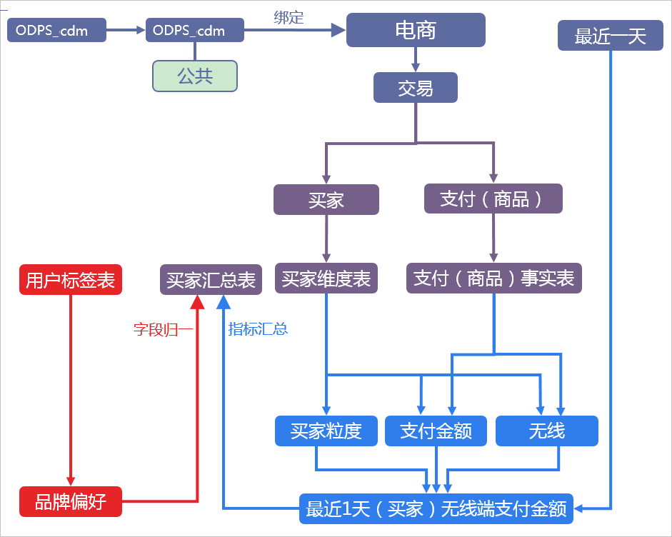

# 中台体系建设方法论

## 0x00.基本概念术语确定

### a.关于表设计`键`的术语

- 键：键是唯一标识一个实体的一个或者多个数据属性。在物理数据库中，键可以由表的一个或者多个列组成，它们的值唯一标识关系表中的一行。
- 复合键：由两个或者多个属性组成的键。
- 自然键：由现实世界中已经存在的属性组成的键。例如，美国公民被分配了一个唯一（不保证一定正确，但实际上非常接近唯一）的社会保险号（SSN）。如果隐私法允许的话，SSN可能被用作Person实体的自然键（假设组织的人员范围仅限于美国）。
- 代理键：不具有业务含义的键。
- 候选键：在逻辑数据模型中的实体类型可能具有0或多个候选键，简称为唯一标识（注解：某些人不主张在逻辑数据模型中标识候选键，因此没有固定标准）。例如，假设我们只涉及美国公民，那么SSN。Person实体类型的一个候选键，同时姓名与电话号码的组合（假设组合是唯一的）是第二个可能的候选键。这两个键都被称作候选键是因为它们是物理数据模型中主键、次键或者非键的候选目标。
- 主键：实体类型的首选键。
- 备用键：也就是次键，是表中行的另一个唯一标识。
- 外键：在一个实体类型中表示另一个实体类型的主键或者次键的一个或多个属性。

> 对上述不够明确的同学推荐阅读：[Choosing a Primary Key: Natural or Surrogate?](http://www.agiledata.org/essays/keys.html)

### b.关于数据仓库的表设计

- 3nf：
- 维度建模：

### c.数仓中的一些基本概念

- 业务板块：比数据域更高维度的业务划分方法，适用于特别庞大的业务系统。
- 维度：维度建模由Ralph Kimball提出。维度模型主张从分析决策的需求出发构建模型，为分析需求服务。维度是度量的环境，是我们观察业务的角度，用来反映业务的一类属性 。属性的集合构成维度 ，也可以称为实体对象。例如， 在分析交易过程时，可以通过买家、卖家、商品和时间等维度描述交易发生的环境。
- 属性（维度属性）：维度所包含的表示维度的列称为维度属性。维度属性是查询约束条件、分组和报表标签生成的基本来源，是数据易用性的关键。
- 度量：在维度建模中，将度量称为事实 ， 将环境描述为维度，维度是用于分析事实所需要的多样环境。度量通常为数值型数据，作为事实逻辑表的事实。
- 指标：指标分为原子指标和派生指标。原子指标是基于某一业务事件行为下的度量，是业务定义中不可再拆分的指标，是具有明确业务含义的名词 ，体现明确的业务统计口径和计算逻辑，例如支付金额。
- 原子指标 = 业务过程 + 度量
- 派生指标 = 时间周期 + 修饰词 + 原子指标，派生指标可以理解为对原子指标业务统计范围的圈定。
- 业务限定：统计的业务范围，筛选出符合业务规则的记录（类似于SQL中where后的条件，不包括时间区间）。
- 统计周期：统计的时间范围，例如最近一天，最近30天等（类似于SQL中where后的时间条件）。
- 统计粒度：统计分析的对象或视角，定义数据需要汇总的程度，可理解为聚合运算时的分组条件（类似于SQL中的group by的对象）。粒度是维度的一个组合，指明您的统计范围。例如，某个指标是某个卖家在某个省份的成交额，则粒度就是卖家、地区这两个维度的组合。如果您需要统计全表的数据，则粒度为全表。在指定粒度时，您需要充分考虑到业务和维度的关系。统计粒度常作为派生指标的修饰词而存在。

基本概念之间的关系和举例如下图所示:

## 0x01.数据划分之横向拆分

> 在阿里巴巴的数据体系中，我们建议将数据仓库分为三层，自下而上为：数据引入层（ODS，Operation Data Store）、数据公共层（CDM，Common Data Model）和数据应用层（ADS，Application Data Service）。

数据仓库的分层和各层级用途如下图所示。

- 数据引入层（ODS，Operation Data Store）：将原始数据几乎无处理的存放在数据仓库系统，结构上与源系统基本保持一致，是数据仓库的数据准备区。主要完成基础数据引入到数据平台的职责，同时可以基础数据记录的历史变化的。 
- 数据公共层（CDM，Common Data Model，又称通用数据模型层），包含DIM维度表、DWD和DWS，由ODS层数据加工而成。主要完成数据加工与整合，建立一致性的维度，构建可复用的面向分析和统计的明细事实表，以及汇总公共粒度的指标。
  - 公共维度层（DIM，Dimension）：基于`维度建模`理念思想，建立整个企业的一致性维度。降低数据计算口径和算法不统一风险。 公共维度层的表通常也被称为逻辑维度表，维度和维度逻辑表通常一一对应。建立一致性维度是整个企业数据仓库搭建的重中之重。
  - 明细粒度事实层（DWD，Data Warehouse Details）：以业务过程作为建模驱动，基于每个具体的业务过程特点，构建最细粒度的明细层事实表。可以结合企业的数据使用特点，将明细事实表的某些重要维度属性字段做适当冗余，即宽表化处理。 明细粒度事实层的表通常也被称为逻辑事实表。
  - 公共汇总粒度事实层（DWS，Data Warehouse Service）：以分析的主题对象作为建模驱动，基于上层的应用和产品的指标需求，构建公共粒度的汇总指标事实表，以宽表化手段物理化模型。构建命名规范、口径一致的统计指标，为上层提供公共指标，建立汇总宽表、明细事实表。 公共汇总粒度事实层的表通常也被称为汇总逻辑表，用于存放派生指标数据。
- 数据应用层（ADS，Application Data Service）：存放数据产品个性化的统计指标数据。根据CDM与ODS层加工生成。

### 1.数据引入层（ODS，Operation Data Store）又叫操作数据层

> ODS层存放您从业务系统获取的最原始的数据，是其他上层数据的源数据。业务数据系统中的数据通常为非常细节的数据，经过长时间累积，且访问频率很高，是面向应用的数据。注意数据引入时的类型转换（业务系统与数仓间的类型，具体根据数仓选型来定），其他尽量与源系统一直即可。

#### a.数据引入层表设计

本教程中，在ODS层主要包括的数据有：交易系统订单详情、用户信息详情、商品详情等。这些数据未经处理，是最原始的数据。逻辑上，这些数据都是以二维表的形式存储。虽然严格的说ODS层不属于数仓建模的范畴，但是合理的规划ODS层并做好数据同步也非常重要。本教程中，使用了6张ODS表：

- 记录用于拍卖的商品信息：`s_auction` 
- 记录用于正常售卖的商品信息：`s_sale` 
- 记录用户详细信息：`s_users_extra` 
- 记录新增的商品成交订单信息：`s_biz_order_delta`
- 记录新增的物流订单信息：`s_logistics_order_delta`
- 记录新增的支付订单信息：`s_pay_order_delta`

> **说明：**
> 1. 表或字段命名尽量和业务系统保持一致，但是需要通过额外的标识来区分增量和全量表。例如，我们通过`_delta`来标识该表为增量表。
> 2. 命名时需要特别注意冲突处理，例如不同业务系统的表可能是同一个名称。为区分两个不同的表，您可以将这两个同名表的来源数据库名称作为后缀或前缀。例如，表中某些字段的名称刚好和关键字重名了，可以通过添加`_col1`后缀解决。

#### b.数据引入层存储

为了满足历史数据分析需求，您可以在ODS层表中添加时间维度作为分区字段。实际应用中，您可以选择采用**增量**、**全量存储**或**拉链存储**的方式。

- 增量存储

以天为单位的增量存储，以业务日期作为分区，每个分区存放日增量的业务数据。 举例如下：

1月1日，用户A访问了A公司电商店铺B，A公司电商日志产生一条记录t1。1月2日，用户A又访问了A公司电商店铺C，A公司电商日志产生一条记录t2。采用增量存储方式，t1将存储在1月1日这个分区中，t2将存储在1月2日这个分区中。

|记录|用户|店铺|日期(分区)|
|-|-|-|-|
|t1|A|B|20200101|
|t2|A|C|20200102|

1月1日，用户A在A公司电商网购买了B商品，交易日志将生成一条记录t1。1月2日，用户A又将B商品退货了，交易日志将更新t1记录。采用增量存储方式，初始购买的t1记录将存储在1月1日这个分区中，更新后的t1将存储在1月2日这个分区中。

|记录|用户|商品|状态|日期(分区)|
|-|-|-|-|-|
|t1|A|B|购买|20200101|
|t2|A|B|退货|20200102|

> **说明：**交易、日志等事务性较强的ODS表适合增量存储方式。这类表数据量较大，采用全量存储的方式存储成本压力大。此外，这类表的下游应用对于历史全量数据访问的需求较小（此类需求可通过数据仓库后续汇总后得到）。例如，日志类ODS表没有数据更新的业务过程，因此所有增量分区UNION在一起就是一份全量数据。

- 全量存储

以天为单位的全量存储，以业务日期作为分区，每个分区存放截止到业务日期为止的全量业务数据。 例如， 1月1日，卖家A在A公司电商网发布了B、C两个商品，前端商品表将生成两条记录t1、t2。1月2日，卖家A将B商品下架了，同时又发布了商品D，前端商品表将更新记录t1，同时新生成记录t3。采用全量存储方式， 在1月1日这个分区中存储t1和t2两条记录，在1月2日这个分区中存储更新后的t1以及t2、t3记录。

|记录|用户|商品|状态|日期(分区)|
|-|-|-|-|-|
|t1|卖家A|商品B|上架|20200101|
|t2|卖家A|商品C|上架|20200101|
|t1|卖家A|商品B|下架|20200102|
|t2|卖家A|商品C|上架|20200102|
|t3|卖家A|商品D|上架|20200102|

> **说明：**对于小数据量的缓慢变化维度数据，例如商品类目，可直接使用全量存储。

- 拉链存储

拉链存储通过新增两个时间戳字段（start_dt和end_dt），将所有以天为粒度的变更数据都记录下来，通常分区字段也是这两个时间戳字段。

拉链存储举例如下。

|商品|start_dt|end_dt|卖家|状态|
|-|-|-|-|-|
|B|20160101|20160102|A|上架|
|C|20160101|30001231|A|上架|
|B|20160102|30001231|A|下架|

> 这样，下游应用可以通过限制时间戳字段来获取历史数据。例如，用户访问1月1日数据，只需限制 `stat_dt` <= '20160101' AND `end_dt` > '20160101'。

- 缓慢变化维度

构建数据架构时不推荐使用代理键，推荐使用自然键作为维度主键，主要原因有两点：
- 数据中台使用的一般都是分布式计算引擎，生成全局唯一的代理键工作量非常大。当遇到大数据量情况下，这项工作就会更加复杂，且没有必要。
- 使用代理键会增加ETL的复杂性，从而增加ETL任务的开发和维护成本。
- 因为是分布式系统，统一不重复的代理键维护起来并不容易。

在不使用代理键的情况下，缓慢变化维度可以通过快照方式处理。
快照方式下数据的计算周期通常为每天一次。基于该周期，处理维度变化的方式为每天一份全量快照。

例如商品维度，每天保留一份全量商品快照数据。任意一天的事实表均可以取到当天的商品信息，也可以取到最新的商品信息，通过限定日期，采用自然键进行关联即可。该方式的优势主要有以下两点：
- 处理缓慢变化维度的方式简单有效，开发和维护成本低。
- 使用方便，易于理解。数据使用方只需要限定日期即可取到当天的快照数据。任意一天的事实快照与任意一天的维度快照通过维度的自然键进行关联即可。

该方法的弊端主要是存储空间的极大浪费。例如某维度每天的变化量占总体数据量比例很低，极端情况下，每天无变化，这种情况下存储浪费严重。该方法主要实现了通过牺牲存储获取ETL效率的优化和逻辑上的简化。请避免过度使用该方法，且必须要有对应的数据生命周期制度，清除无用的历史数据。

#### c.数据同步加载与处理

ODS的数据需要由各数据源系统同步到数据仓库，才能用于进一步的数据开发。在使用数据集成的过程中，建议您遵循以下规范：
- 一个系统的源表只允许同步到数据中台一次，保持表结构的一致性。
- 数据集成仅用于离线全量数据同步，实时增量数据同步要使用流式的方式处理。
- 数据集成全量同步的数据直接进入全量表的当日分区。
- ODS层的表建议以统计日期及时间分区表的方式存储，便于管理数据的存储成本和策略控制。
- 数据集成可以自适应处理源系统字段的变更：
  - 如果源系统字段的目标表在数据仓库不存在，可以由数据集成自动添加不存在的表字段。
  - 如果目标表的字段在源系统不存在，数据集成填充NULL。

### 2.数据公共层（CDM，Common Data Model）

> 数据公共层CDM可以细分为三层，分别为公共维度层（DIM，Dimension）、明细粒度事实层（DWD，Data Warehouse Details）、公共汇总粒度事实层（DWS，Data Warehouse Service），下面分别介绍：

#### a.公共维度层（DIM，Dimension）

公共维度层（DIM）基于维度建模理念，建立整个企业的一致性维度。

公共维度层主要由维度表（维表）构成。维度是逻辑概念，是衡量和观察业务的角度。维表是根据维度及其属性将数据平台上构建的表物理化的表，采用宽表设计的原则。因此，构建公共维度层（DIM）首先需要定义维度。

##### 定义维度

在划分数据域、构建总线矩阵时，需要结合对业务过程的分析定义维度。以本教程中A电商公司的营销业务板块为例，在交易数据域中，我们重点考察确认收货（交易成功）的业务过程。在确认收货的业务过程中，主要有商品和收货地点（本教程中，假设收货和购买是同一个地点）两个维度所依赖的业务角度。

- 从商品角度可以定义出以下维度：
  - 商品ID
  - 商品名称
  - 商品价格
  - 商品新旧程度： 0 全新 1 闲置 2 二手
  - 商品类目ID
  - 商品类目名称
  - 品类ID
  - 品类名称
  - 买家ID
  - 商品状态： 0 正常 1 用户删除 2 下架 3 从未上架
  - 商品所在城市
  - 商品所在省份
- 从地域角度，可以定义出以下维度：
  - 买家ID
  - 城市code
  - 城市名称
  - 省份code
  - 省份名称

作为维度建模的核心，在企业级数据仓库中必须保证维度的唯一性。以A公司的商品维度为例，有且只允许有一种维度定义。例如，省份code这个维度，对于任何业务过程所传达的信息都是一致的。

##### 设计维表

完成维度定义后，您就可以对维度进行补充，进而生成维表了。维表的设计需要注意：
- 建议维表单表信息不超过1000万条。
- 维表与其他表进行Join时，建议您使用Map Join。使用mapjoin缓存小表，可以有效避免数据倾斜。
- 避免过于频繁的更新维表的数据。

在设计维表时，您需要从下列方面进行考虑：
- 维表中数据的稳定性。例如A公司电商会员通常不会出现消亡，但会员数据可能在任何时候更新，此时要考虑创建单个分区存储全量数据。如果存在不会更新的记录，您可能需要分别创建历史表与日常表。日常表用于存放当前有效的记录，保持表的数据量不会膨胀；历史表根据消亡时间插入对应分区，使用单个分区存放分区对应时间的消亡记录。
- 是否需要垂直拆分。如果一个维表存在大量属性不被使用，或由于承载过多属性字段导致查询变慢，则需考虑对字段进行拆分，创建多个维表。
- 是否需要水平拆分。如果记录之间有明显的界限，可以考虑拆成多个表或设计成多级分区。
- 核心的维表产出时间通常有严格的要求。

设计维表的主要步骤如下：
1. 完成维度的初步定义，并保证维度的一致性。
2. 确定主维表（中心事实表，本教程中采用星型模型）。此处的主维表通常是数据引入层（ODS）表，直接与业务系统同步。例如，s_auction是与前台商品中心系统同步的商品表，此表即是主维表。
3. 确定相关维表。数据仓库是业务源系统的数据整合，不同业务系统或者同一业务系统中的表之间存在关联性。根据对业务的梳理，确定哪些表和主维表存在关联关系，并选择其中的某些表用于生成维度属性。以商品维度为例，根据对业务逻辑的梳理，可以得到商品与类目、卖家、店铺等维度存在关联关系。
4. 确定维度属性，主要包括两个阶段。第一个阶段是从主维表中选择维度属性或生成新的维度属性；第二个阶段是从相关维表中选择维度属性或生成新的维度属性。以商品维度为例，从主维表（ s_auction）和类目 、卖家、店铺等相关维表中选择维度属性或生成新的维度属性。
5. 尽可能生成丰富的维度属性。
6. 尽可能多地给出富有意义的文字性描述。
7. 区分数值型属性和事实。
8. 尽量沉淀出通用的维度属性。

##### 公共维度汇总层（DIM）维表规范

公共维度汇总层（DIM）维表命名规范：`dim_{业务板块名称/pub}_{维度定义}[_{自定义命名标签}]`，所谓pub是与具体业务板块无关或各个业务板块都可公用的维度，如时间维度。举例如下：
- 公共区域维表 `dim_pub_area`
- A公司电商板块的商品全量表 `dim_asale_itm`

#### b.明细粒度事实层（DWD，Data Warehouse Details）

> 明细粒度事实层以业务过程驱动建模，基于每个具体的业务过程特点，构建最细粒度的明细层事实表。您可以结合企业的数据使用特点，将明细事实表的某些重要维度属性字段做适当冗余，即宽表化处理。

公共汇总粒度事实层（DWS）和明细粒度事实层（DWD）的事实表作为数据仓库维度建模的核心，需紧绕业务过程来设计。通过获取描述业务过程的度量来描述业务过程，包括引用的维度和与业务过程有关的度量。度量通常为数值型数据，作为事实逻辑表的依据。事实逻辑表的描述信息是事实属性，事实属性中的外键字段通过对应维度进行关联。

事实表中一条记录所表达的业务细节程度被称为粒度。通常粒度可以通过两种方式来表述：一种是维度属性组合所表示的细节程度，一种是所表示的具体业务含义。

作为度量业务过程的事实，通常为整型或浮点型的十进制数值，有可加性、半可加性和不可加性三种类型：
- 可加性事实是指可以按照与事实表关联的任意维度进行汇总。
- 半可加性事实只能按照特定维度汇总，不能对所有维度汇总。例如库存可以按照地点和商品进行汇总，而按时间维度把一年中每个月的库存累加则毫无意义。
- 完全不可加性，例如比率型事实。对于不可加性的事实，可分解为可加的组件来实现聚集。

事实表相对维表通常更加细长，行增加速度也更快。维度属性可以存储到事实表中，这种存储到事实表中的维度列称为维度退化，可加快查询速度。与其他存储在维表中的维度一样，维度退化可以用来进行事实表的过滤查询、实现聚合操作等。

明细粒度事实层（DWD）通常分为三种：事务事实表、周期快照事实表和累积快照事实表。
- 事务事实表用来描述业务过程，跟踪空间或时间上某点的度量事件，保存的是最原子的数据，也称为原子事实表。
- 周期快照事实表以具有规律性的、可预见的时间间隔记录事实。
- 累积快照事实表用来表述过程开始和结束之间的关键步骤事件，覆盖过程的整个生命周期，通常具有多个日期字段来记录关键时间点。当累积快照事实表随着生命周期不断变化时，记录也会随着过程的变化而被修改。

##### 明细粒度事实表设计原则

明细粒度事实表设计原则如下所示：
- 通常，一个明细粒度事实表仅和一个维度关联。
- 尽可能包含所有与业务过程相关的事实 。
- 只选择与业务过程相关的事实。
- 分解不可加性事实为可加的组件。
- 在选择维度和事实之前必须先声明粒度。
- 在同一个事实表中不能有多种不同粒度的事实。
- 事实的单位要保持一致。
- 谨慎处理Null值。
- 使用退化维度提高事实表的易用性。

明细粒度事实表整体设计流程如下图所示。
在一致性度量中已定义好了交易业务过程及其度量。明细事实表注意针对业务过程进行模型设计。明细事实表的设计可以分为四个步骤：选择业务过程、确定粒度、选择维度、确定事实（度量）。粒度主要是在维度未展开的情况下记录业务活动的语义描述。在您建设明细事实表时，需要选择基于现有的表进行明细层数据的开发，清楚所建表记录存储的是什么粒度的数据。

#### c.公共汇总粒度事实层（DWS，Data Warehouse Service）

