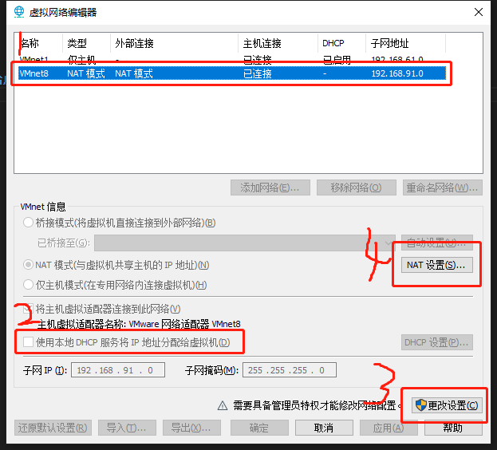
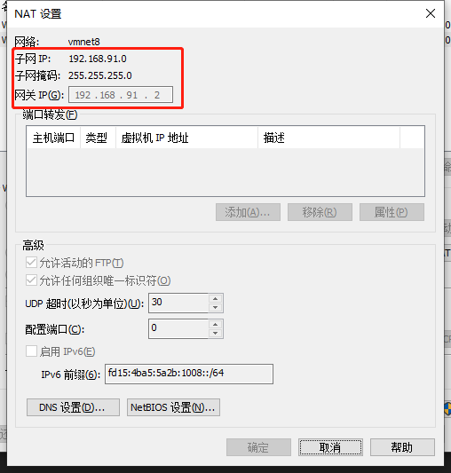
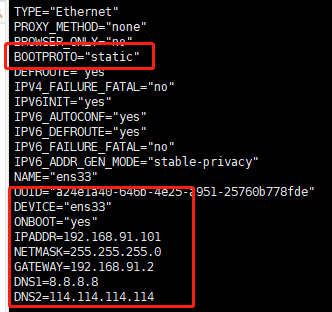

# Cloudera Manager 6.2.0 离线安装

## 0x01.准备

## 0x02.安装

### 1.虚拟机

#### a.安装虚拟机

#### b.调整设置，配置静态IP

1. 点击vmware菜单栏中的 **编辑** 按钮，点击 **虚拟网络编辑器** 
2. 在弹窗中上面，选择 **NAT模式**，将下面**使用本地DHCP服务将IP地址分配给虚拟机**选项去掉（如果不能更改，点击下面的更改设置）。
   
3. 点击NAT设置，记录里面的`ip`，`子网掩码`以及`网关ip`后，点击保存。
   
4. 进入windows网络管理器，查看网络连接，选择我们刚刚调整的NAT模式网卡（VMnet8）。
   
5. 右键点击属性，双击IPv4，将记录的信息填进去，点击保存。
   
   
6. 启动虚拟机，登陆后执行命令修改IP: `vi /etc/sysconfig/network-scripts/ifcfg-ens33`
   
   ```properties
   BOOTPROTO="static"
   ONBOOT="yes"
   IPADDR=192.168.xxx.xxx
   NETMASK=255.255.255.0
   GATEWAY=192.168.xxx.x
   DNS1=8.8.8.8
   DNS2=114.114.114.114
   ```

   修改完后为：

   
7. 保存后，使用：`service network restart` 或者 `systemctl restart network` 重启网络服务。
8. 测试是否有网络：`ping www.baidu.com`。如下则正常，同样方式配置剩下的虚拟机（注意ip不同）。
   
