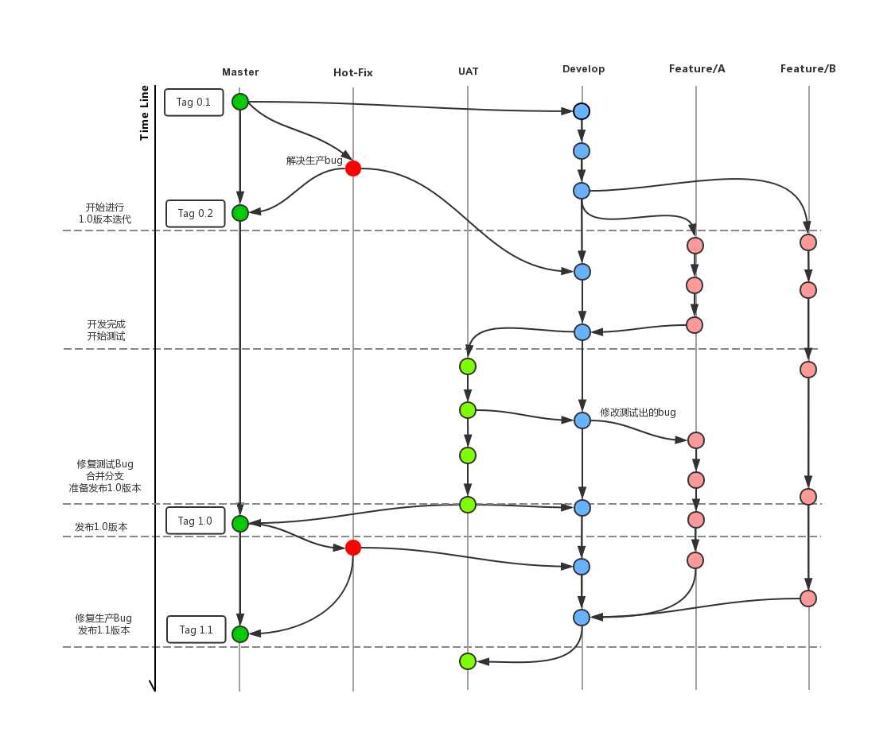
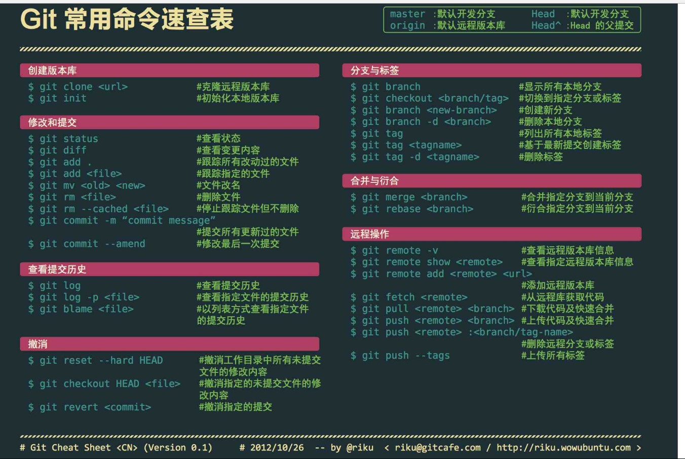

# 软件工程版本管理与GIT相关操作

## 0x01.工程化版本管理GIT分支流程图



## 0x02.流程简介

### 1.分支介绍

- `Master`: 主分支，该分支限制提交，只可以拉取。只有**TL**在可以合并分支。
- `Hot-Fix`: 解决**Master**分支的线上**Bug**时，使用此分支进行紧急修复，修复后合并到**Mastet/Develop**分支。
- `UAT`: 测试分支，当版本开发完毕，进行集中测试时，从**Develop**分支拉取。
- `Develop`: 开发分支，新版本的迭代分支，开发人员分支从该分支拉取。
- `Feature/AB`: 每个开发的个人分支，从**Develop**分支拉取，开发完成后**merge**到**Develop**分支。

### 2.流程及命令介绍

- 初始化仓库

```shell
# 创建README
echo "# init project" >> README.md

# 初始化
git init

# 添加文件
git add README.md

# 提交到本地，-m 表示注释
git commit -m "first commit"

# 添加到远程仓库
git remote add origin https://host:port/project.git

# 提交到Master分支
git push -u origin master
```

- 创建分支

```shell
# 查看分支列表以及当前分支
git branch

# 创建分支，是分支的当前分支的代码
git checkout -b <分支名>
```

- 提交代码

```shell
# 添加文件 .表示添加当前目录及子目录全部，不添加全部可以指定文件
git add .
git commit -m "添加注释"
git push
```

- 合并分支

```shell
# 首先切换到主分支
git checkout master

# merge uat 分支到主分支
git merge --no-ff uat
```

- 解决冲突，使用过程中出现版本冲突情况很正常，如果出现冲突，重新编辑冲突的文件再次提交就可以了。

```shell
# 冲突文件会标记=====，按照需求修改后，再次提交
git add .
git commit
```

- tag 管理
  
当版本开发完成后，合并到开发环境，测试以及bug修改完毕。从uat分支合并到master后，需要进行打一个tag标记，属于留档记录。

```shell
# 创建一个tag
git tag -a <tag name>

# 删除一个tag
git tag -d <tag name>

# tag默认是不提交到远程服务器的，使用命令提交
git push origin --tags

# 查看tag
git tag

# 通过tag检出
git checkout tag
```

## 0x03.GIT命令速度差表



## 0x04.参考文章

- `git 如何获取指定 tag 代码`: [http://yijiebuyi.com/blog/eacf4d053fad77affffae397d9af7172.html](http://yijiebuyi.com/blog/eacf4d053fad77affffae397d9af7172.html)
- `git 使用详解（8）-- tag打标签`: [https://blog.csdn.net/wh_19910525/article/details/7470850](https://blog.csdn.net/wh_19910525/article/details/7470850)
- `Git 分支管理最佳实践`: [https://www.ibm.com/developerworks/cn/java/j-lo-git-mange/index.html](https://www.ibm.com/developerworks/cn/java/j-lo-git-mange/index.html)
- `Git分支管理`: [https://segmentfault.com/a/1190000011927868](https://segmentfault.com/a/1190000011927868)
- `Git分支管理策略`: [http://www.ruanyifeng.com/blog/2012/07/git.html](http://www.ruanyifeng.com/blog/2012/07/git.html)
